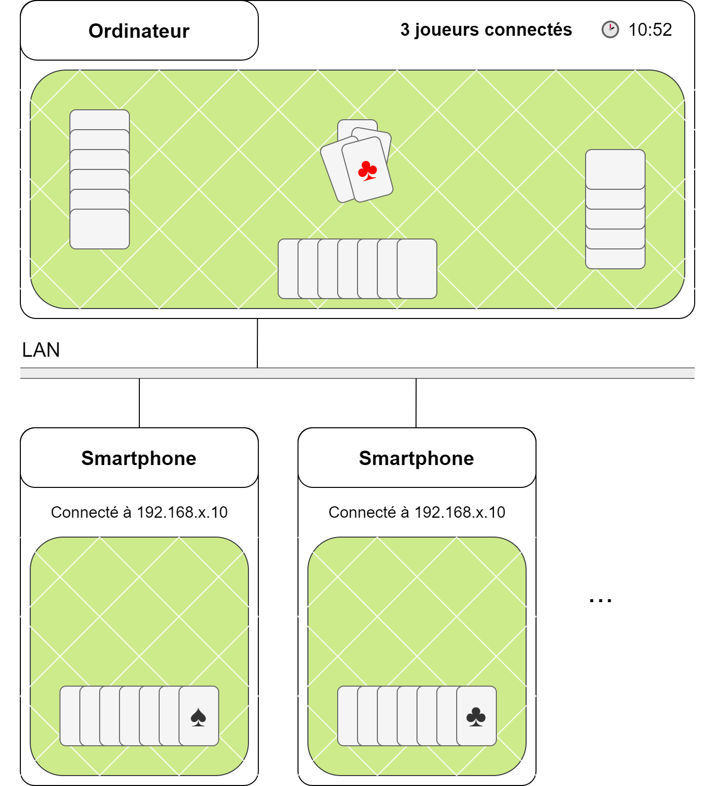

# cards

This repository is linked to the Cards project, which is hosted on GitLab. The project is focused on building a card-based game system with key features like multiplayer modes, strategy development, and user interfaces.

Features:
- Multiplayer functionality
- Interactive game interface
- Dynamic card game rules
  
For more information and to contribute, visit the original project on GitLab:
https://gitlab.com/nierven/cards

